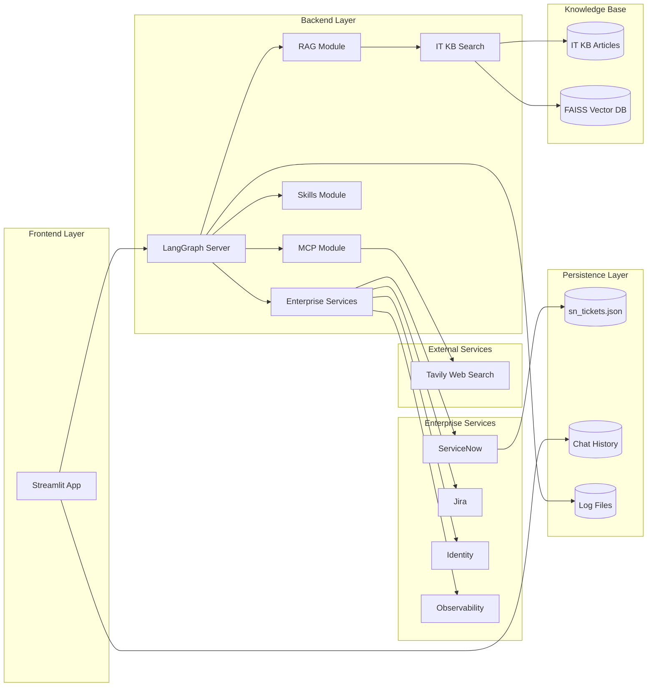

# Project AERO: AI-Enabled Regional Operations
## Internal Codename: itechops

## 1. Project Overview

**Project Name**: Project AERO  
**Project Type**: RAG-based IT Helpdesk Intelligent Assistant  
**Technical Architecture**: Frontend-backend separation, backend based on LangGraph, frontend based on Streamlit  

### 1.1 Core Value Proposition

Project AERO is an intelligent IT support agent that provides efficient IT support services for enterprises by integrating three core capabilities:

| Capability Module | Function Description | Technical Implementation |
|------------------|---------------------|------------------------|
| **RAG Retrieval** | Search internal IT knowledge base for policies and procedures | FAISS + NVIDIA Embeddings + Rerank |
| **Web Search** | Get real-time information via Tavily | MCP protocol integration |
| **Skills System** | Dynamically load specialized skills for specific tasks | Dynamic skill directory loading |

---

## 2. Project Architecture

### 2.1 Overall Architecture Diagram



### 2.2 Module Responsibilities

| Module | Responsibility | Core File |
|--------|---------------|-----------|
| **Frontend** | User interface, conversation display, history management | `code/frontend/app.py` |
| **Backend Agent** | RAG retrieval, tool calling, LLM inference | `code/backend/rag_agent.py` |
| **MCP Service** | Web search proxy | `code/backend/mcp_server.py` |
| **Knowledge Base** | IT policy document storage | `data/it-kb-articles/*.md` |
| **Skills System** | Specialized skill definitions | `skills/*/SKILL.md` |
| **Enterprise Services** | Mock enterprise integrations | `code/backend/services/*.py` |

---

## 3. Project Directory Structure

```
project-aero/
├── code/                          # Source code directory
│   ├── backend/                   # LangGraph backend
│   │   ├── rag_agent.py           # RAG Agent core implementation
│   │   ├── mcp_server.py          # MCP server (web search)
│   │   ├── services/              # Enterprise service mocks
│   │   │   ├── __init__.py
│   │   │   ├── servicenow.py
│   │   │   ├── jira.py
│   │   │   ├── identity.py
│   │   │   └── observability.py
│   │   └── langgraph.json         # LangGraph configuration
│   └── frontend/                  # Streamlit frontend
│       └── app.py                 # Frontend main application
├── data/                          # Data directory
│   ├── it-kb-articles/            # IT knowledge base articles
│   │   ├── email-distribution-lists.md
│   │   ├── hardware-refresh.md
│   │   ├── help-and-support.md
│   │   ├── hpc-cluster-access.md
│   │   ├── reset-password.md
│   │   ├── security-incident-reporting.md
│   │   ├── software-installation.md
│   │   ├── source-control-management.md
│   │   ├── update-pii.md
│   │   ├── virtual-desktop-request.md
│   │   ├── vpn.md
│   │   └── wifi-access.md
│   └── sn_tickets.json            # ServiceNow ticket data (mock)
├── skills/                        # Skills directory
│   ├── code_review/               # Code review skill
│   │   └── SKILL.md
│   └── technical_writing/         # Technical writing skill
│       └── SKILL.md
├── storage/                       # Runtime storage (auto-created)
│   ├── logs/                      # Log files
│   ├── chat_history/              # Chat history (separated by role)
│   │   ├── employee/              # Employee chat history
│   │   └── engineer/              # IT Engineer chat history
├── .env                           # Environment variables
├── requirements.txt               # Python dependencies
├── setup_env.sh                   # Environment setup script
├── README.md                      # Project documentation
└── PROJECT_DESCRIPTION.md         # Detailed project description
```

---

## 4. Core Technical Implementation

### 4.1 Backend Architecture

#### 4.1.1 RAG Module (`rag_agent.py`)

**Core Flow**:
1. **Document Loading**: Load all markdown files from knowledge base directory using `DirectoryLoader`
2. **Document Splitting**: Split documents into chunks using `RecursiveCharacterTextSplitter`
3. **Vector Embedding**: Generate document vectors using NVIDIA Embeddings model
4. **Vector Storage**: Build vector database using FAISS
5. **Retrieval Enhancement**: Re-rank retrieval results using NVIDIARerank

**Key Parameters**:
- `CHUNK_SIZE`: 800 (characters per chunk)
- `CHUNK_OVERLAP`: 120 (overlapping characters between chunks)
- `k`: 6 (number of documents returned)

#### 4.1.2 MCP Service (`mcp_server.py`)

**Technical Features**:
- Uses Starlette framework for SSE (Server-Sent Events) transport
- Web search via Tavily API
- Supports advanced search depth (`search_depth="advanced"`)
- Returns up to 5 search results

#### 4.1.3 Agent Configuration

**LLM Model**: `nvidia/nemotron-3-super-120b-a12b`
- Temperature: 0.6 (moderate randomness)
- Max tokens: 4096

**Tool List**:
| Tool Name | Description | Use Cases |
|-----------|-------------|-----------|
| `it_knowledge_base` | Search internal IT knowledge base | Password reset, VPN issues, software installation |
| `web_search` | Web search | Current events, external resources |
| `list_skills` | List available skills | Discover available expertise |
| `get_skill` | Load specific skill | Code review, technical writing |
| `servicenow_create_ticket` | Create ServiceNow tickets | IT incident logging |
| `servicenow_assign_ticket` | Assign ServiceNow tickets | Ticket routing |
| `servicenow_close_ticket` | Close ServiceNow tickets | Ticket resolution |
| `jira_create_engineering_task` | Create Jira tasks | Engineering escalation |
| `identity_verify_user` | Verify user identity | AD verification |
| `identity_reset_password` | Reset user password | Okta password reset |
| `observability_get_network_status` | Get network status | Network troubleshooting |

#### 4.1.4 ServiceNow Mock Service (`services/servicenow.py`)

**Features**:
- **Persistent Storage**: Uses `data/sn_tickets.json` for ticket data persistence
- **CRUD Operations**: Create, read, update, and delete tickets
- **Dynamic ID Generation**: Auto-incrementing ticket IDs (INC-0001, INC-0002, etc.)
- **Ticket Schema**: `ticket_id`, `issue_type`, `user_email`, `description`, `status`, `priority`, `created_at`, `assigned_to`, `resolution`
- **Status Management**: Supports "New", "In Progress", and "Closed" statuses

**API Functions**:
| Function | Description |
|----------|-------------|
| `create_ticket()` | Create new ticket with optional description |
| `get_ticket()` | Retrieve ticket by ID |
| `list_tickets()` | List all tickets (optional status filter) |
| `assign_ticket()` | Assign ticket to support group |
| `close_ticket()` | Close ticket with resolution |
| `update_ticket()` | Update ticket fields |

### 4.2 Frontend Architecture

#### 4.2.1 Main Features

1. **Dual-Role System**: Employee and IT Support Engineer views with role-specific features
2. **Chat Interface**: Implemented using Streamlit's `chat_message` component
3. **History Management**: Save/load conversation history as JSON files (role-separated)
4. **Reasoning Display**: Show AI thinking process via expandable panels
5. **Operations Dashboard**: Display IT operational metrics for engineers
6. **Diagnostic Tools**: Generate platform-specific diagnostic scripts
7. **Conversation Closure Flow**: Ticket creation workflow for employees

#### 4.2.2 State Management

**Session State Structure**:
- `threads`: Store thread IDs for each assistant
- `history`: Store chat history messages for each assistant
- `ticket_logs`: Store ServiceNow ticket operation logs
- `user_role`: Current user role (Employee/IT Support Engineer)
- `is_engineer`: Boolean flag for engineer view

**Persistence Mechanism**:
- History file format: `{assistant_id[:8]}_{thread_id}.json`
- Storage directory: `storage/chat_history/{role}/`

---

## 5. Configuration and Deployment

### 5.1 Environment Variables

| Variable | Description | Required |
|----------|-------------|----------|
| `NVIDIA_API_KEY` | NVIDIA AI Endpoints API key | Yes |
| `TAVILY_API_KEY` | Tavily search API key | Yes |
| `LANGGRAPH_API_URL` | LangGraph server address (default: `http://127.0.0.1:2024`) | No |

### 5.2 Dependency List

**Core Dependencies**:
| Dependency | Version | Purpose |
|------------|---------|---------|
| `langgraph` | >1,<2 | Agent workflow management |
| `langgraph-cli` | - | LangGraph development tools |
| `streamlit` | ~=1.49.1 | Frontend framework |
| `faiss-cpu` | ~=1.12.0 | Vector database |
| `langchain-nvidia-ai-endpoints` | >1,<2 | NVIDIA LLM integration |
| `tavily-python` | ~=0.7.19 | Web search |
| `python-dotenv` | ~=0.9.9 | Environment variable management |

### 5.3 Startup Process

#### 1. Start Backend Service

```bash
cd code/backend
langgraph dev
```

Wait for: `Ready accept requests at http://127.0.0.1:2024`

#### 2. Start Frontend Application

```bash
streamlit run code/frontend/app.py
```

Access at: `http://localhost:8501`

---

## 6. Knowledge Base Content

### 6.1 Knowledge Base Articles

| Article Name | Topic |
|--------------|-------|
| `email-distribution-lists.md` | Email distribution list management |
| `hardware-refresh.md` | Hardware refresh policy |
| `help-and-support.md` | Help and support procedures |
| `hpc-cluster-access.md` | HPC cluster access |
| `reset-password.md` | Password reset |
| `security-incident-reporting.md` | Security incident reporting |
| `software-installation.md` | Software installation procedures |
| `source-control-management.md` | Source control management |
| `update-pii.md` | PII information update |
| `virtual-desktop-request.md` | Virtual desktop request |
| `vpn.md` | VPN access |
| `wifi-access.md` | WiFi access |

---

## 7. Skills System

### 7.1 Available Skills

#### 1. Code Review Skill (`skills/code_review/SKILL.md`)

**Function**: Provides systematic code review methodology

**Review Dimensions**:
- **Correctness**: Does the code work as expected?
- **Security**: Input validation, secret handling, error handling
- **Performance**: Loop efficiency, data structure selection, query optimization
- **Readability**: Naming conventions, comments, formatting consistency
- **Maintainability**: DRY principle, single responsibility, testability

**Feedback Format**: Structured review report with Summary, Strengths, Suggestions, and Priorities

#### 2. Technical Writing Skill (`skills/technical_writing/SKILL.md`)

**Function**: Provides technical documentation writing guidelines

**Structure Guidelines**:
1. Executive Summary - 2-3 sentence overview
2. Key Points - Bullet points
3. Details - Comprehensive content
4. Conclusion - Action items

**Style Guide**:
- Active voice
- Sentences under 25 words
- Define abbreviations on first use
- Use concrete examples

---

## 8. Runtime Storage

### 8.1 Directory Structure

```
storage/
├── logs/                          # Log directory
│   ├── frontend_YYYYMMDD.log      # Frontend logs
│   ├── backend_YYYYMMDD.log       # Backend logs
│   └── llm_activity_YYYYMMDD.log  # LLM activity logs
└── chat_history/                  # Chat history
    ├── employee/                  # Employee conversation history
    └── engineer/                  # IT Engineer conversation history
```

### 8.2 Log Configuration

**Log Level**: INFO  
**Log Format**: `%(asctime)s - %(name)s - %(levelname)s - %(message)s`  
**Output**: Both file and console

---

## 9. Extension Capabilities

### 9.1 Add New Skill

Create new directory under `skills/` with `SKILL.md` file:

```bash
mkdir -p skills/new_skill
cat > skills/new_skill/SKILL.md << 'EOF'
---
name: new_skill
description: Description of the skill
---

# Skill Content
...
EOF
```

### 9.2 Update Knowledge Base

Add new markdown files to `data/it-kb-articles/` directory. System will automatically load them.

### 9.3 Add New Services

Add new mock services in `code/backend/services/` and register them in `__init__.py` and `rag_agent.py`.

---

## 10. Technical Highlights

| Feature | Description |
|---------|-------------|
| **RAG Enhancement** | Combines vector retrieval and Rerank to improve answer quality |
| **MCP Protocol** | Standardized tool calling interface supporting multi-service integration |
| **Dynamic Skill Loading** | On-demand expertise loading extends Agent capabilities |
| **Conversation Persistence** | Save and restore conversation history with role separation |
| **Reasoning Display** | View AI thinking process for transparency |
| **Multi-assistant Support** | Run multiple different Agents simultaneously |
| **Dual-Role System** | Separate views for employees and IT support engineers |
| **ServiceNow Integration** | Automated ticket creation, assignment, and closure |
| **Diagnostic Tools** | Cross-platform diagnostic script generation |
| **Operations Dashboard** | Real-time IT operational metrics display |
| **Conversation Closure Flow** | Employee ticket creation workflow |

---

## 11. Acknowledgments

This project is based on NVIDIA's Build An Agent Workshop (https://github.com/brevdev/workshop-build-an-agent). The core RAG implementation, LangGraph orchestration patterns, and NVIDIA AI Endpoints integration were adapted from this workshop.

### Key Changes from Original Workshop

- **Dual-Role System**: Added employee and IT support engineer views
- **Enterprise Integrations**: Implemented mock services for ServiceNow, Jira, Identity, and Observability
- **Operations Dashboard**: Added IT operational metrics display
- **Diagnostic Tools**: Created cross-platform diagnostic script generation
- **Conversation Closure Flow**: Implemented ticket creation workflow
- **Enhanced UI**: Improved chat interface with reasoning display and history management

### Copyright and Usage

- **NVIDIA Materials**: All original content from NVIDIA's workshop retains its original copyright and belongs to NVIDIA Corporation.
- **Modifications**: Custom modifications and extensions are provided for educational and demonstration purposes only.
- **Non-Commercial Use**: This project is a personal project and should not be used for commercial purposes.

**Disclaimer**: This is not an official NVIDIA product or project.

---

## 12. Summary

Project AERO is a comprehensive IT Helpdesk intelligent assistant that provides efficient, professional IT support services for enterprises through integrated RAG retrieval, web search, and dynamic skill loading. The project features modular design for easy extension and maintenance, making it suitable as a foundation for enterprise IT support systems.

Employees can initiate IT support requests via Slack Bot, and the system provides a complete workflow from question answering to ticket creation and resolution.