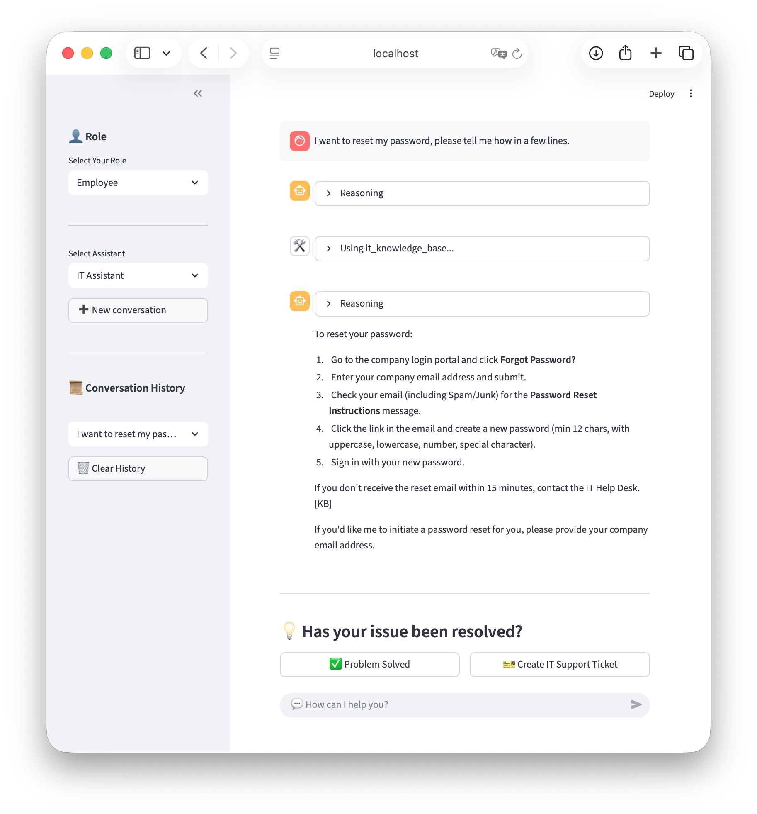
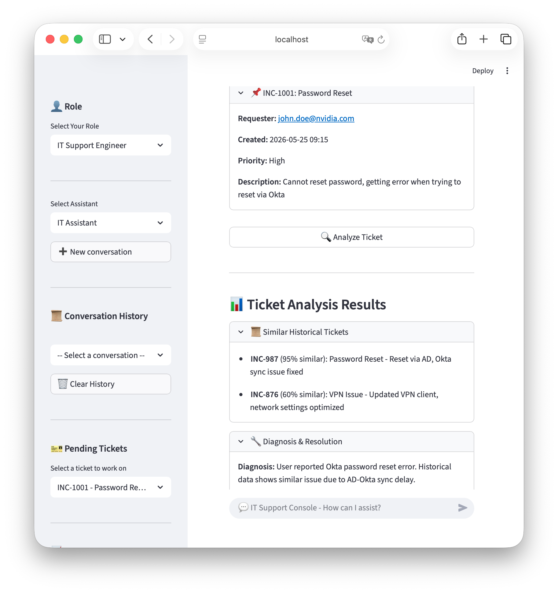

# Project AERO: AI-Enabled Regional Operations Platform

Intelligent IT Operations Assistant powered by NVIDIA NIM technology.

## 🎯 Overview

AERO is an intelligent IT support agent for regional operations that combines:

- **RAG** - Knowledge base retrieval for IT help desk
- **MCP** - Web search via Tavily for current information
- **Skills** - Dynamic expertise loading for specialized tasks
- **Enterprise Services** - Mock integrations for ServiceNow, Jira, Identity, and Observability

### Employee View


### IT Support Engineer View


## 🤖 NVIDIA AI Models Used

This project leverages NVIDIA's state-of-the-art AI models for optimal performance:

| Model Type | Model Name | Purpose |
|------------|------------|---------|
| **LLM** | `nvidia/nemotron-3-super-120b-a12b` | Primary language model for reasoning and response generation |
| **Embedding** | `nvidia/llama-nemotron-embed-1b-v2` | Generate vector embeddings for RAG retrieval |
| **Rerank** | `nvidia/llama-nemotron-rerank-1b-v2` | Re-rank search results to improve relevance |

### Model Differences from NVIDIA Workshop

While this project is based on NVIDIA's Build An Agent Workshop, the following modifications were made to the model configuration:

- **Embedding Model**: Changed from workshop default to `nvidia/llama-nemotron-embed-1b-v2`
- **Rerank Model**: Changed from workshop default to `nvidia/llama-nemotron-rerank-1b-v2`

All models are accessed via NVIDIA AI Endpoints API.

## 📁 Project Structure

```
project-aero/
├── code/
│   ├── backend/           # LangGraph backend
│   │   ├── rag_agent.py   # RAG agent implementation
│   │   ├── mcp_server.py  # MCP server for web search
│   │   ├── services/      # Enterprise service mocks
│   │   │   ├── __init__.py
│   │   │   ├── servicenow.py
│   │   │   ├── jira.py
│   │   │   ├── identity.py
│   │   │   └── observability.py
│   │   └── langgraph.json
│   └── frontend/          # Streamlit frontend
│       └── app.py
├── data/
│   ├── it-kb-articles/    # IT knowledge base articles
│   └── sn_tickets.json    # ServiceNow ticket data (mock)
├── docs/
│   └── images/            # Documentation images
├── skills/                # Agent skills
│   ├── code_review/
│   └── technical_writing/
├── storage/               # Runtime storage (logs, chat history)
├── .env                   # Environment variables
├── requirements.txt       # Python dependencies
├── setup_env.sh           # Environment setup script
└── start.sh               # Quick start script
```

## 🚀 Quick Start

### 1. Setup Environment

```bash
# Run the setup script
bash setup_env.sh

# Activate the environment
conda activate proj-aero
```

### 2. Configure Environment Variables

Create a `.env` file with your API keys:

```env
NVIDIA_API_KEY=your_nvidia_api_key
TAVILY_API_KEY=your_tavily_api_key
```

### 3. Start the Backend

```bash
cd code/backend
langgraph dev
```

Wait for: `Ready accept requests at http://127.0.0.1:2024`

### 4. Start the Frontend

In a new terminal:

```bash
streamlit run code/frontend/app.py
```

### Alternative: One-Click Start

```bash
bash start.sh
```

## 💡 Features

- **Dual-Role Access Control**: Separate interfaces for employees and IT support engineers
- **IT Knowledge Base**: Searches internal IT policies and procedures
- **Web Search**: Real-time information via Tavily MCP
- **Skills System**: Dynamic expertise loading for specialized tasks
- **Conversation History**: Persistent chat history across sessions
- **Reasoning Display**: View AI thinking process
- **ServiceNow Integration**: Automated ticket creation, assignment, and closure
- **Operations Dashboard**: IT operational metrics display
- **Diagnostic Tools**: Cross-platform diagnostic script generation

## 🏢 Enterprise Services

Project AERO integrates with the following enterprise services via mock implementations:

| Service | Description | Status |
|---------|-------------|--------|
| **ServiceNow** | IT service management, ticket creation and tracking | Mock |
| **Jira** | Engineering task management, escalation | Mock |
| **Identity** | Active Directory/Okta user verification and password reset | Mock |
| **Observability** | Grafana/Prometheus network status monitoring | Mock |

## 🛠️ Development

### Add New Skills

Create a new skill in `skills/<skill_name>/SKILL.md`

### Update Knowledge Base

Add markdown files to `data/it-kb-articles/`

### Add New Services

Add new mock services in `code/backend/services/`

### Environment Setup

See `setup_env.sh` for complete environment configuration

## 🌐 Access

- **Backend API**: http://127.0.0.1:2024
- **Frontend UI**: http://localhost:8501

## ℹ️ Note

All enterprise service integrations are mock implementations for demonstration purposes. In production, replace these with real API calls.

## 🙏 Acknowledgments

This project is based on NVIDIA's [Build An Agent Workshop](https://github.com/brevdev/workshop-build-an-agent). Core LangGraph agent orchestration and NVIDIA AI Endpoints integration follow the official workshop design patterns, and are fully adapted and customized for enterprise IT operations scenarios.

### Key Changes from Original Workshop

While this project builds upon the workshop foundation, significant modifications have been made:

- **Dual-Role System**: Added employee and IT support engineer views with role-specific features
- **Enterprise Integrations**: Implemented mock services for ServiceNow, Jira, Identity management, and Observability
- **Operations Dashboard**: Added IT operational metrics display for engineers
- **Diagnostic Tools**: Created cross-platform diagnostic script generation functionality
- **Conversation Closure Flow**: Implemented ticket creation workflow for employees
- **Enhanced UI**: Improved chat interface with reasoning display and conversation history management

### Copyright and Usage

- **NVIDIA Materials**: All original content from NVIDIA's workshop retains its original copyright and belongs to NVIDIA Corporation.
- **Modifications**: Custom modifications and extensions in this repository are provided for educational and demonstration purposes only.
- **Non-Commercial Use**: This project is a personal project and should not be used for commercial purposes without proper licensing.

**Disclaimer**: This is not an official NVIDIA product or project. It is a personal learning project based on publicly available educational materials.